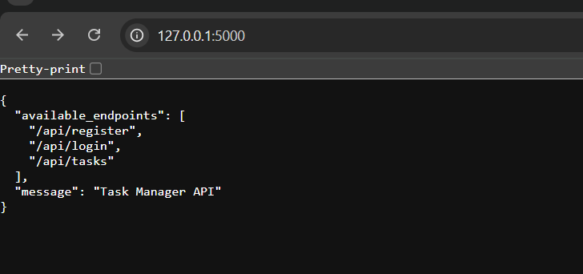

# Task Manager API

A RESTful API for managing tasks with user authentication built with Flask.

<p align="center">
  
</p>


<p align="center">
  
</p>


- User registration and authentication (JWT)
- CRUD operations for tasks
- Pagination and filtering
- User roles (admin/user)
- Comprehensive testing
- API documentation

## Setup Instructions

### Prerequisites

- Python 3.8+
- pip (Python package manager)

### Installation

1. Clone the repository:
```bash
git clone <https://github.com/Pooja2579/Task-manager.git>
cd task_manager_api